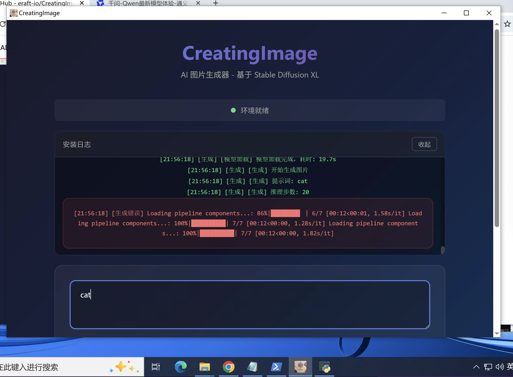

# AI 图片生成器 - 安装使用指南

基于 Stable Diffusion XL 的桌面应用，支持通过文字描述生成图片。

**支持平台**: macOS (M 芯片) | Windows (GPU/CUDA)

[English Documentation](README_en.md)

## 文件说明

| 文件 | 说明 | 下载链接 |
|------|------|----------|
| `CreatingImage-macos-arm64.pkg` | M 芯片 Mac 安装包 | [下载](https://github.com/eraft-io/CreatingImage/releases/download/v1.0.0/CreatingImage-macos-arm64.pkg) |
| `CreatingImage-windows.exe` | Windows 可执行程序 | [下载](https://github.com/eraft-io/CreatingImage/releases/download/v1.0.0/CreatingImage-windows.zip) |

## 系统要求

### macOS
- **系统版本**: 11.0 (Big Sur) 或更高版本
- **芯片支持**: Apple Silicon (M1/M2/M3) 或 Intel 芯片
- **内存**: 至少 8GB 内存（推荐 16GB）
- **磁盘空间**: 约 10GB 可用空间（用于模型下载）
- **网络**: 首次启动需要下载 Python 依赖和 AI 模型

### Windows
- **系统版本**: Windows 10/11 64位
- **Python**: Python 3.11（必须预先安装）
- **内存**: 至少 8GB 内存（推荐 16GB）
- **磁盘空间**: 约 10GB 可用空间（用于模型下载）
- **显卡**: NVIDIA 显卡（推荐 4GB 显存以上）
- **网络**: 首次启动需要下载 Python 依赖和 AI 模型

### Windows 预装要求

在运行 Windows 版本前，请确保已安装：

1. **Python 3.11**
   - 从 [python.org](https://www.python.org/downloads/windows/) 下载安装
   - 安装时勾选 "Add Python to PATH"
   - 验证安装：`python --version`

2. **Microsoft C++ 生成工具**
   - 安装 pip 依赖时需要编译 C++ 扩展
   - 下载地址：[Microsoft C++ Build Tools](https://visualstudio.microsoft.com/visual-cpp-build-tools/)
   - 安装时选择 **"使用 C++ 的桌面开发"** 工作负载
   - 或下载 Visual Studio Community 并安装 C++ 开发组件

### Windows 常见问题

#### Q: 安装依赖时提示 "Microsoft Visual C++ 14.0 or greater is required"

**A:** 需要安装 Microsoft C++ 生成工具：

1. 访问 [Microsoft C++ Build Tools](https://visualstudio.microsoft.com/visual-cpp-build-tools/)
2. 下载并运行 **Build Tools for Visual Studio**
3. 在安装界面勾选 **"使用 C++ 的桌面开发"**
4. 点击安装，等待完成（约 5-10GB）
5. 重启电脑后重新运行应用

或者使用命令行快速安装（约 6GB）：
```powershell
# 使用 Visual Studio Installer
winget install Microsoft.VisualStudio.2022.BuildTools --override "--wait --passive --add Microsoft.VisualStudio.Workload.VCTools"
```

## 应用演示

### 示例图片，提示词 - tian an men square in cartoon.


### macOS 版本


### Windows 10 版本



## 性能对比: Mac M 芯片 vs Windows NVIDIA

### 为什么 Mac M 芯片比 Windows NVIDIA 显卡更快

| 特性 | Mac M 芯片 | Windows NVIDIA  |
|------|-----------|---------------------|
| **内存架构** | CPU/GPU 统一内存池 | CPU 内存 + GPU 显存分离 |
| **数据传输** | 几乎零拷贝，无 PCIe 瓶颈 | 需通过 PCIe 复制数据 |
| **模型加载** | 直接访问大内存，无需分批 | 受显存容量限制 |
| **内存带宽** | 高带宽统一内存 (400-800 GB/s) | 显存带宽高但容量受限 |

### 关键差异说明

**1. 统一内存架构 (Unified Memory)**
- Mac M 芯片的 CPU 和 GPU 共享同一物理内存池
- 大模型可以直接加载到内存中，无需分批处理
- 数据传输几乎零延迟

**2. 显存限制的影响**
- NVIDIA 16GB 显存处理大模型时可能触发:
  - 梯度检查点 (gradient checkpointing) - 增加计算开销
  - CPU 卸载 (CPU offloading) - 频繁的 PCIe 数据传输
  - 分批推理 - 增加整体延迟

**3. 软件优化**
- Mac: Metal Performance Shaders (MPS) 后端针对 Apple Silicon 高度优化
- Windows: CUDA 虽强大，但 PyTorch 的 Windows 优化路径较长

### 实际场景示例

生成 1024x1024 图像时:
```
Mac M2/M3: 使用 20-30GB 统一内存，无瓶颈，推理流畅
NVIDIA 16GB: 可能触发内存优化策略，增加 20-50% 延迟
```

### Windows NVIDIA 优化建议

如需提升 Windows 版本性能:

1. **启用半精度推理**
   ```python
   torch_dtype=torch.float16
   ```

2. **使用 torch.compile()** (PyTorch 2.0+)
   ```python
   model = torch.compile(model)
   ```

3. **启用 CUDA 图捕获** - 减少 CPU 开销

4. **确保 CUDA 版本匹配** - 本应用已配置 CUDA 12.1
